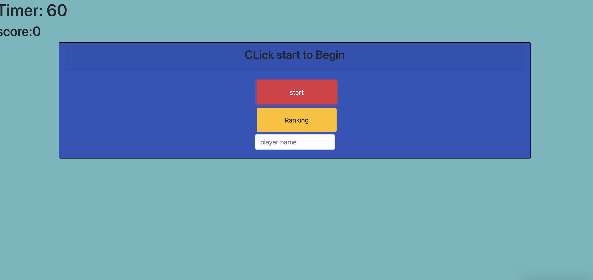
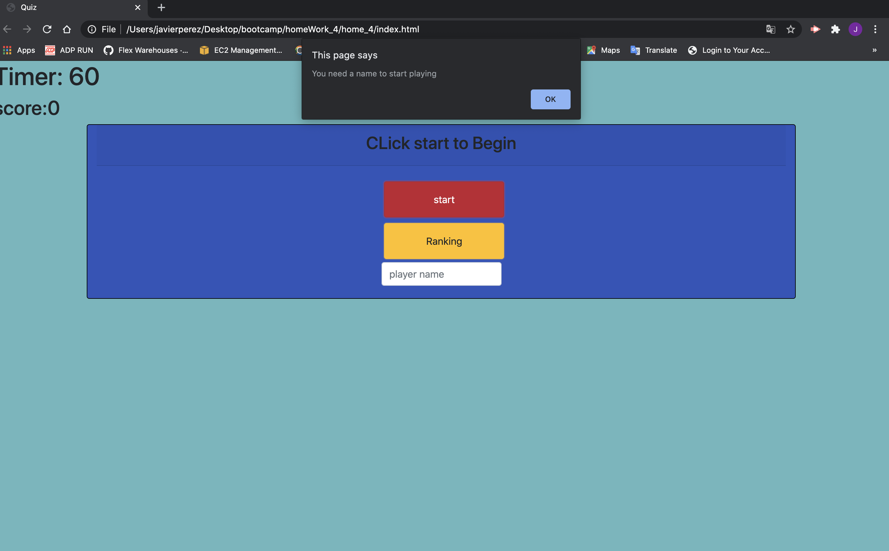
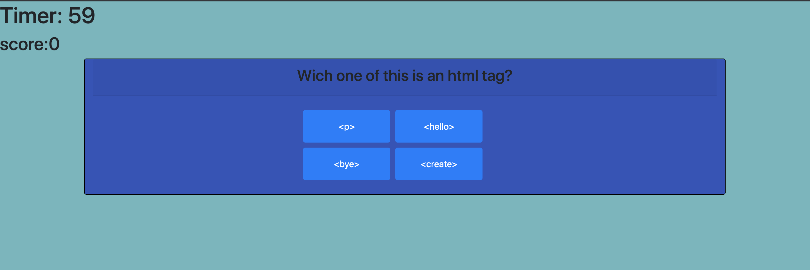
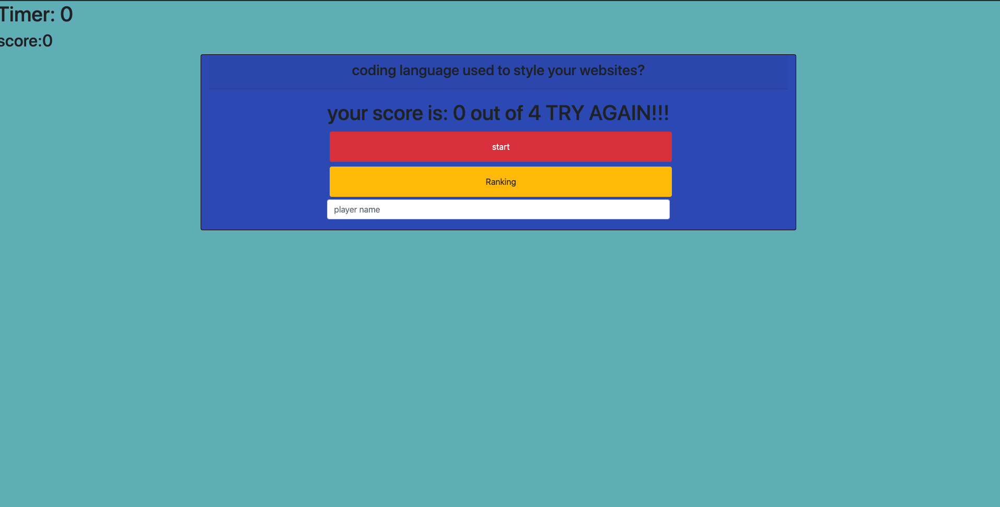

# home_4

## My Respository
this is the repo where all the magic is happening for Coding Quiz (https://github.com/japb1998/home_4). 

On this homeWork we are creating a Quiz , in wich you are asked 4 questions, if your result is more than 2 you pass, if not you can always play again and see what score you get.
## Files
contains an index.html file with the structure of my app, a quiz.css giving the styling to my app and we have a quiz.js giving the functionality that it needs.

## APP

## you need yo give you name so you can play

 ## you have 4 possible answers
 
 ## Result
 